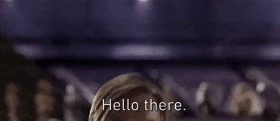

    

 
    Keywords that introduce me : 
    Computer :computer: 
    Cyber Security :unlock:
    Blue Team :blue_book:
    Networks 🌐
    Robotic 🤖
    Arduino 🔌
    Hardware System 🧰
    Python 🐍
    Biker :bicyclist: 
    Photographer :camera: 
    Model Rocketer 🚀
    
 

<h3 align="left">Connect with me:</h3>

<h3 align="left">Languages and Tools:</h3>

        

    

        
    

    

        

        

    

